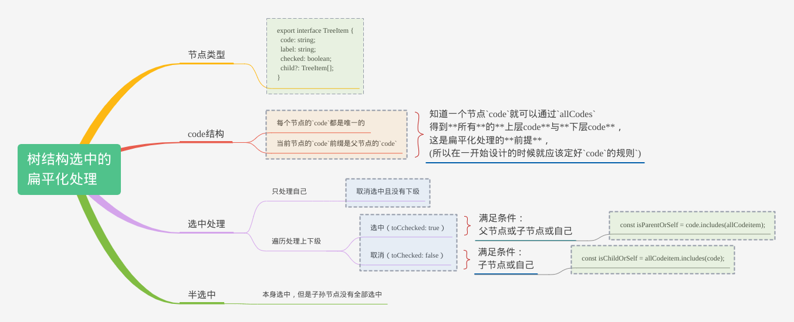

# 树结构选中的扁平化处理

树结构选中常见在权限树



本文以一种扁平的方式去处理权限树的几点：

- 选中
- 半选中
- child处理
- parent处理

## 1、前置说明

[一个例子](https://codesandbox.io/s/tree-data-to-checked-uoy2rt)，本文代码[源码](https://github.com/zero9527/tree-data-to-checked)

### 1.1 节点数据与类型

每一个节点数据包含了**是否选中**，因为本文的处理方式，其实节点没有`checked`，使用另外一个字段如`checkedCodes`传递就可以了；这个要看情况，即使放在一起，使用前提取出来就好了最终再加回去也很简单

```ts
export interface TreeItem {
  code: string;
  label: string;
  checked: boolean;
  child?: TreeItem[];
}
```

```ts
export const permissionData: TreeItem[] = [
  {
    code: "Product_Manage",
    label: "产品管理",
    checked: false,
    child: [
      {
        code: "Product_Manage_List",
        label: "产品列表",
        checked: false,
        child: [
          { code: "Product_Manage_List_Export", label: "导出", checked: false },
          { code: "Product_Manage_List_Create", label: "新建", checked: false },
          { code: "Product_Manage_List_Detail", label: "详情", checked: false },
          { code: "Product_Manage_List_Update", label: "编辑", checked: false },
          { code: "Product_Manage_List_Delete", label: "删除", checked: false },
        ],
      },
    ],
  },
  // ...
]
```

### 1.2 节点code处理

- 每个节点的`code`都是唯一的
- 当前节点的`code`前缀是父节点的`code`

也就是说，知道一个节点`code`就可以通过`allCodes`得到**所有**的**上层code**与**下层code**，这是扁平化处理的**前提**(所以在一开始设计的时候就应该定好`code的规则`)

> 不一定叫code，可以是其他满足特点的命名

- **所有的**`allCodes: string[]`

用于替代树结构遍历

```ts
// src/components/Permission/tree-data/utils.ts
/**
 * 获取所有的code
 * @param treeData
 */
export function getAllCodes(treeData: TreeItem[]): string[] {
  const codes: string[] = [];
  treeData.forEach((item) => {
    codes.push(item.code);
    if (item.child?.length) codes.push(...getAllCodes(item.child));
  });
  return codes;
}
```

- **选中的**`checkedCodes: string[]`

用于判断是否选中，初始化时候使用

```ts
// src/components/Permission/tree-data/utils.ts
/**
 * 获取所有checked为true的code
 * @param treeData
 */
export function getCheckedCodes(treeData: TreeItem[]): string[] {
  const codes: string[] = [];
  treeData.forEach((item) => {
    if (item.checked) codes.push(item.code);
    if (item.child?.length) codes.push(...getCheckedCodes(item.child));
  });
  return codes;
}
```

### 1.3 输出新数据

一般修改数据只要选中的`code`就够了；如果需要树结构整棵树的数据，只需要用`checkedCodes`去遍历整棵树重新设置`checked`即可，看需要转一次即可

```ts
// src/components/Permission/tree-data/utils.ts
/**
 * 设置checked值
 * @param treeData
 */
export function setCheckedByValue(
  treeData: TreeItem[],
  toChecked: boolean
): TreeItem[] {
  treeData.forEach((item) => {
    item.checked = toChecked;
    if (item.child?.length) {
      item.child = setCheckedByValue(item.child, toChecked);
    }
  });
  return treeData;
}
```

## 2、节点渲染

### 2.1 接收参数

- treeData: 权限树的数据
- checkedCodesRaw：原始的选中code
- onChange

```tsx
// src/components/Permission/index.tsx
import { useMemo } from "react";
import { Checkbox } from "antd";
import { TreeItem } from "./tree-data";
import { useCheckHandle } from "./useCheckHandle";
import { TreeNode } from "./TreeNode";
import "./styles.css";

export interface PermisisonProps {
  checkedCodesRaw: string[]; // 选中的code[]
  treeData: TreeItem[];
  onChange?: (codes: string[]) => void;
}

/**
 * 权限树渲染
 * @description code结构为{ParentCode}_{ChildCode}，当前code的结构即可知道祖先code
 */
export const Permission: React.FC<PermisisonProps> = (props) => {
  const {
    allCodes,
    checkedCodes,
    isAllChecked,
    isIndeterminate,
    handleCheck,
    onCheckAll,
  } = useCheckHandle(props);

  // 全选的半选中状态
  const isAllIndeterminate = useMemo(() => {
    if (!checkedCodes.length) return false;
    return checkedCodes.length !== allCodes.current.length;
  }, [allCodes, checkedCodes]);

  return (
    <div className="Permission">
      <div>
        <Checkbox
          checked={isAllChecked}
          indeterminate={isAllIndeterminate}
          onClick={() => onCheckAll(!isAllChecked)}
        >
          全选
        </Checkbox>
      </div>
      {!!props.treeData.length &&
        props.treeData.map((item) => (
          <TreeNode
            key={item.code}
            item={item}
            checkedCodes={checkedCodes}
            isIndeterminate={isIndeterminate}
            handleCheck={handleCheck}
          />
        ))}
    </div>
  );
};
```

### 2.2 渲染处理

- item: 当前节点数据
- checkedCodes: 选中的code
- isIndeterminate: 是否半选中
- handleCheck: 选中处理

```tsx
// src/components/Permission/TreeNode.tsx
import { Checkbox } from "antd";
import { TreeItem } from "./tree-data";

interface TreeNodeProps {
  item: TreeItem;
  checkedCodes: string[];
  isIndeterminate: (code: string) => boolean;
  handleCheck: (code: string, toChecked: boolean) => void;
}

/**
 * 渲染单个节点
 */
export const TreeNode: React.FC<TreeNodeProps> = ({
  item,
  checkedCodes,
  isIndeterminate,
  handleCheck,
}) => {
  const onClick = (code: string) => {
    const toChecked = !checkedCodes.includes(code);
    handleCheck(code, toChecked);
  };

  return (
    <div className="tree-item" data-code={item.code}>
      <Checkbox
        checked={checkedCodes.includes(item.code)}
        indeterminate={isIndeterminate(item.code)}
        onClick={() => onClick(item.code)}
      >
        {item.label}
      </Checkbox>
      {!!item?.child?.length && (
        <section className="tree-item__child-wrapper">
          {item.child.map((childItem) => (
            <TreeNode
              key={childItem.code}
              item={childItem}
              checkedCodes={checkedCodes}
              isIndeterminate={isIndeterminate}
              handleCheck={handleCheck}
            />
          ))}
        </section>
      )}
    </div>
  );
};
```

## 3、数据处理

> 实例代码里面因为使用的是react，由于异步的增量更新state，所以遍历的时候借助ref来同步数据，最终才一次性设置state更新视图。。。如果使用vue或其他循环时可以同步数据的框架就不需要ref这种做中间处理了

主要放在 `useCheckHandle.ts`

### 3.1 半选中

类型: `isIndeterminate: (code: string) => boolean;` 

判断自己选中，  同时子孙节点没有全部选中

```ts
  /** 半选中 */
  const isIndeterminate = (code: string) => {
    const allChildCodes = allCodes.current.filter((i) => i.includes(code));
    if (checkedCodes.includes(code)) {
      return allChildCodes.some((i) => !checkedCodes.includes(i));
    }
    return false;
  };
```

### 3.2 全选

类型:`const onCheckAll = (toChecked: boolean) => void;` 

```ts
  /** 全选 */
  const onCheckAll = (toChecked: boolean) => {
    if (toChecked) {
      checkedCodesRef.current = [...allCodes.current];
    } else {
      checkedCodesRef.current = [];
    }
    setCheckedCodes([...checkedCodesRef.current]);
  }
```

### 3.3 选中

类型:`handleCheck: (code: string, toChecked: boolean) => void;` 

选中处理逻辑`handleCheck`：

- 只处理自己
  - 取消选中且没有下级
- 遍历处理上下级
  - 选中(`toChecked: true`)
    - 满足条件：父节点或子节点或自己
  - 取消(`toChecked: false`)
    - 满足条件：子节点或自己

```ts
// src/components/Permission/useCheckHandle.ts
import { useEffect, useRef, useState } from "react";
import { getAllCodes } from "./tree-data";
import { PermisisonProps } from ".";

/**
 * check处理逻辑
 * @param permissionData
 * @param props
 */
export function useCheckHandle({
  treeData,
  checkedCodesRaw,
  onChange,
}: PermisisonProps) {
  const allCodes = useRef([...getAllCodes(treeData)]);
  const checkedCodesRef = useRef([...checkedCodesRaw]); // 解决循环的数据同步问题
  const [checkedCodes, setCheckedCodes] = useState([...checkedCodesRaw]);
  const [isAllChecked, setIsAllChecked] = useState(false);

  useEffect(() => {
    // console.log("checkedCodes:", checkedCodes);
    setIsAllChecked(checkedCodes.length === allCodes.current.length);
    if (onChange) onChange(checkedCodes);
  }, [checkedCodes, onChange]);

  /** 添加某一个 */
  const addCodeFromCheck = (code: string) => {
    const index = checkedCodesRef.current.indexOf(code);
    if (index === -1) checkedCodesRef.current.push(code);
  };

  /** 删除某一个 */
  const deleteCodeFromCheck = (code: string) => {
    const index = checkedCodesRef.current.indexOf(code);
    if (index !== -1) checkedCodesRef.current.splice(index, 1);
  };

  /** 半选中 */
  const isIndeterminate = (code: string) => {
    const allChildCodes = allCodes.current.filter((i) => i.includes(code));
    if (checkedCodes.includes(code)) {
      return allChildCodes.some((i) => !checkedCodes.includes(i));
    }
    return false;
  };

  /** 选中处理 */
  const handleCheck = (code: string, toChecked: boolean) => {
    // console.log(checkedCodesRef.current, code, toChecked);
    const hasChild = allCodes.current.some(
      (allCodeitem) => code !== allCodeitem && allCodeitem.includes(code)
    );
    // 反选且没有下级:只处理自己
    if (!toChecked && !hasChild) {
      deleteCodeFromCheck(code);
      // console.log("_checkedCodes: ", checkedCodesRef.current);
      setCheckedCodes([...checkedCodesRef.current]);
      return;
    }
    // 遍历处理上下级
    allCodes.current.forEach((allCodeitem) => {
      const isParentOrSelf = code.includes(allCodeitem);
      const isChildOrSelf = allCodeitem.includes(code);
      // console.log(allCodeitem, isParentOrSelf, isChildOrSelf);
      // 处理选中:自己和parent, child
      if (toChecked) {
        if (isParentOrSelf || isChildOrSelf) {
          addCodeFromCheck(allCodeitem);
        }
      } else {
        // 处理反选:自己和child
        if (isChildOrSelf) {
          deleteCodeFromCheck(allCodeitem);
        }
      }
    });
    // console.log("checkedCodesRef.current: ", checkedCodesRef.current);
    setCheckedCodes([...checkedCodesRef.current]);
  };

  /** 全选 */
  const onCheckAll = (toChecked: boolean) => {
    if (toChecked) {
      checkedCodesRef.current = [...allCodes.current];
    } else {
      checkedCodesRef.current = [];
    }
    setCheckedCodes([...checkedCodesRef.current]);
  };

  return {
    allCodes,
    checkedCodes,
    isAllChecked,
    isIndeterminate,
    handleCheck,
    onCheckAll,
  };
}
```


## 4、最后

到这里就完了